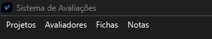
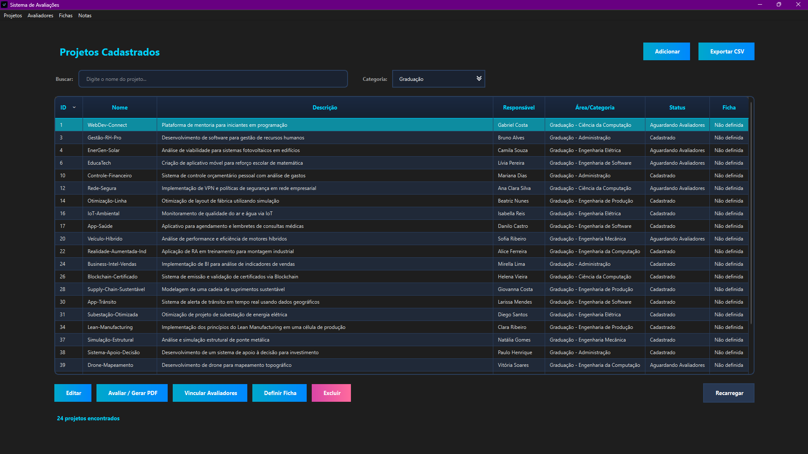
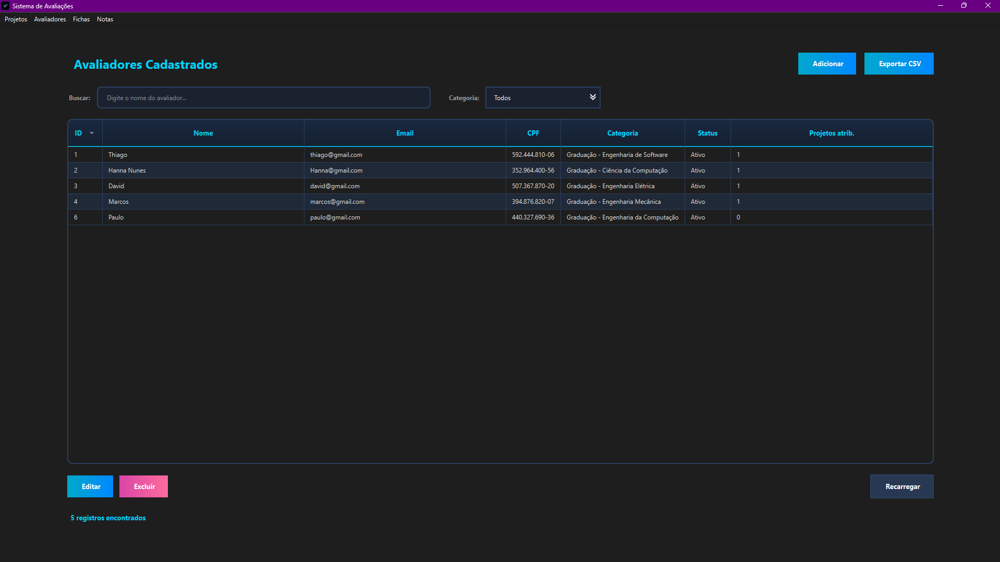
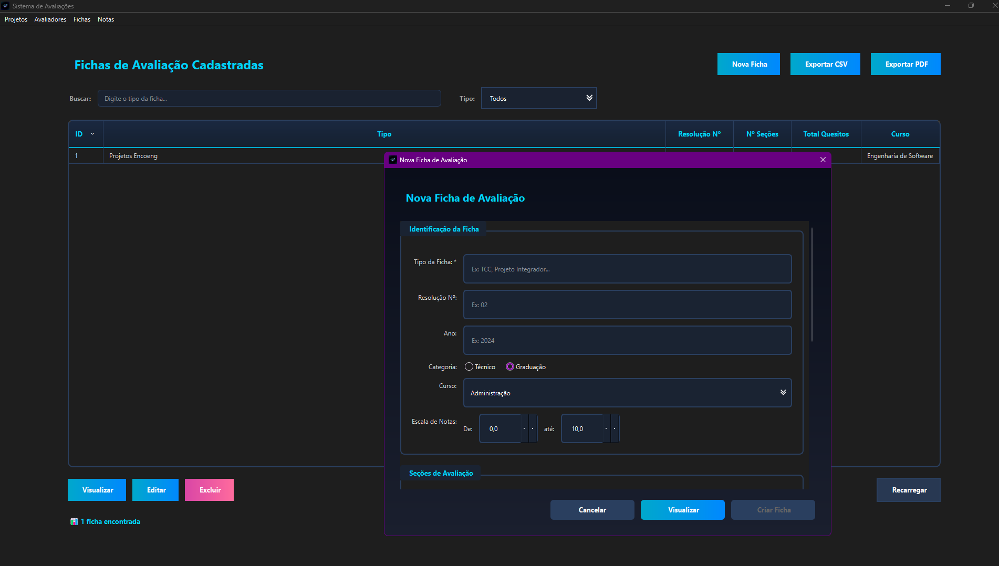
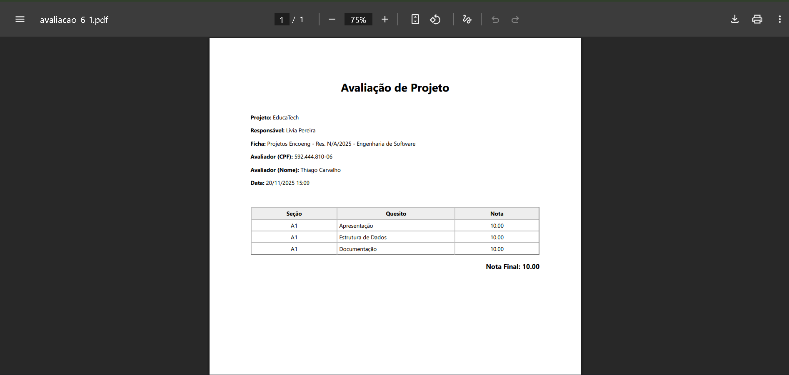

# AvaliaEnconeng

<div align="center">

  


  <p><i>Aplicação desktop completa para gerenciamento de avaliações em eventos acadêmicos</i></p>

</div>

Sistema desenvolvido em **C++** e **Qt** para organizar e automatizar o processo de avaliação de projetos em feiras de ciências, mostras acadêmicas, apresentações de TCC e eventos similares.

[](https://isocpp.org/)
[](https://www.qt.io/)
[](https://cmake.org/)

## Sobre o Projeto

Este sistema foi desenvolvido para resolver um problema real: a dificuldade de coordenar e gerenciar avaliações de múltiplos projetos por diferentes avaliadores em eventos acadêmicos. 

**O que ele faz:**
- Centraliza o cadastro de projetos, avaliadores e critérios de avaliação
- Gerencia quem avalia o quê através de um sistema de vínculos
- Permite que avaliadores lancem notas de forma simples e organizada
- Gera relatórios e exporta dados para análise

**Para quem foi feito:**
- Coordenadores de eventos acadêmicos
- Bancas avaliadoras
- Instituições de ensino que realizam mostras e feiras

---

## Funcionalidades Principais

### Autenticação e Controle de Acesso
- Sistema de login com dois perfis distintos
- **Modo Administrador:** acesso completo ao sistema
- **Modo Avaliador:** visualização restrita aos projetos vinculados
- Autenticação segura por CPF e senha

### Gerenciamento de Projetos
- Cadastro completo com título, área, curso e categoria
- Sistema de filtros por nome, curso ou categoria
- Identificador único para cada projeto
- Edição e remoção com confirmação

### Gerenciamento de Avaliadores
- Cadastro com informações completas (nome, CPF, e-mail, curso)
- Listagem organizada em tabela
- Vinculação flexível a múltiplos projetos
- Controle de participação nas avaliações

### Fichas de Avaliação Personalizadas
- Criação de fichas com critérios customizados
- Definição de pesos e notas máximas por critério
- Exemplos: Apresentação, Inovação, Domínio Técnico, Relevância
- Reutilização de fichas para múltiplas avaliações

### Avaliação Simplificada
- Interface limpa para preenchimento de notas
- Seleção de ficha apropriada para cada projeto
- Preenchimento criterioso com validação
- Cálculo automático da nota final ponderada
- Possibilidade de editar avaliações

### Relatórios e Análise
- Visualização consolidada de todas as avaliações
- Médias automáticas por projeto
- Exportação para CSV (Excel/LibreOffice compatível)
- Geração de relatórios para impressão

---

## Demonstração

### Tela de Login


### Dashboard Administrativo


### Gerenciamento de Projetos


### Gerenciamento de Avaliadores


### Criação de Fichas de Avaliação


### Lançamento e Consulta de Notas


---

## Arquitetura e Organização

O projeto segue uma arquitetura modular com clara separação de responsabilidades:

### Estrutura de Diretórios
```
sistema-avaliacao/
├── CMakeLists.txt
├── main.cpp
├── vinculos.h/.cpp
└── ui/
    └── telas/
        ├── janelaprincipal.h/.cpp/.ui
        ├── dialogologin.h/.cpp/.ui
        ├── paginaprojetos.h/.cpp/.ui
        ├── paginaavaliadores.h/.cpp/.ui
        ├── paginafichas.h/.cpp/.ui
        ├── paginanotas.h/.cpp/.ui
        ├── dialogovincularavaliadores.h/.cpp/.ui
        ├── dialogoselecionarficha.h/.cpp/.ui
        └── dialogoavaliacaoficha.h/.cpp/.ui
```

### Componentes

**Janela Principal (`janelaprincipal`)**
- Container principal da aplicação
- QStackedWidget para navegação entre páginas
- Controla permissões baseadas no perfil do usuário
- Menu lateral para acesso rápido às funcionalidades

**Sistema de Autenticação (`dialogologin`)**
- Validação de credenciais
- Determinação do modo de operação (admin/avaliador)
- Contexto persistido durante toda a sessão

**Páginas de Gerenciamento**
- **Projetos:** CRUD completo, filtros e busca
- **Avaliadores:** gestão da banca avaliadora
- **Fichas:** criação de critérios de avaliação
- **Notas:** lançamento, edição e relatórios

**Módulo de Vínculos (`vinculos.h/.cpp`)**
- Lógica central de relacionamentos
- Persistência de vínculos em arquivo
- Consultas otimizadas para listagem

### Persistência de Dados

Sistema de arquivos simples e eficiente:

| Arquivo | Conteúdo |
|---------|----------|
| `projetos.txt` | Cadastro de projetos |
| `avaliadores.txt` | Cadastro de avaliadores |
| `fichas.txt` | Definições de fichas e critérios |
| `vinculos.txt` | Relacionamentos avaliador-projeto |
| `notas.csv` | Avaliações e notas lançadas |

**Vantagens:**
- Fácil inspeção e depuração
- Compatível com ferramentas de planilha
- Backup e versionamento simplificados
- Não requer instalação de banco de dados

---

## Stack Tecnológica

### Core
- **Linguagem:** C++17 com recursos modernos (auto, lambdas, smart pointers)
- **Framework:** Qt 5/6 Widgets para interface gráfica nativa
- **Build:** CMake 3.16+ para configuração multiplataforma

### Qt Modules
- **QtCore:** containers, strings, file I/O
- **QtWidgets:** componentes de interface (QMainWindow, QDialog, QTableView)
- **QtGui:** modelos de dados (QStandardItemModel)
- **QtPrintSupport:** geração de relatórios (opcional)

---

## Como Compilar e Executar

## Atenção 
- O login para entra no Sistema é :

- **Login** : admin
- **Senha** : admin123

### Pré-requisitos

- **Qt Framework:** versão 5.15+ ou 6.x
  - **Download:** [Qt Creator (Community)](https://www.qt.io/download-open-source) (Clique aqui para entra no site oficial)
  - Escolha a versão **Qt Creator Community** (gratuita)
  - Durante a instalação, selecione:
    - Qt 5.15.2 ou Qt 6.x (a mais recente)
    - Kit de desenvolvimento para seu sistema operacional
    - CMake (se não estiver instalado)
- **CMake:** versão 3.16 ou superior
- **Compilador C++17:**
  - Linux: GCC 7+ ou Clang 5+
  - Windows: MSVC 2017+ ou MinGW (incluído no Qt)
  - macOS: Xcode 10+ ou Clang
### Instalação Rápida

#### 1. Clone o repositório
```bash
git clone https://github.com/SEU_USUARIO/sistema-avaliacao-projetos.git
```

#### 1.1 Encontre a pasta
```bash
cd sistema-avaliacao-projetos
```

#### 2. Compile com Qt Creator (Recomendado)

1. Abra o **Qt Creator**
2. `File → Open File or Project`
3. Selecione o arquivo `CMakeLists.txt`
4. Configure o kit Qt apropriado
5. Clique em **Configure Project**
6. `Build → Run` ou `Ctrl+R`

## Casos de Uso

### Feira de Ciências do Ensino Médio

**Cenário:** 50 projetos, 10 avaliadores, cada projeto avaliado por 3 pessoas

1. Coordenador cadastra os 50 projetos no sistema
2. Cadastra os 10 avaliadores da banca
3. Cria uma ficha de avaliação com critérios específicos
4. Vincula cada avaliador a 15 projetos (distribuição equilibrada)
5. Avaliadores fazem login e preenchem suas avaliações
6. Coordenador exporta resultados para Excel e calcula vencedores

### Apresentação de TCC

**Cenário:** 30 alunos, 5 bancas diferentes, critérios específicos por curso

1. Coordenação cadastra todos os TCCs
2. Cria fichas diferentes para cada curso (Engenharia, Administração, etc.)
3. Cadastra professores das bancas
4. Vincula cada banca aos TCCs que irá avaliar
5. Professores avaliam durante as apresentações
6. Sistema calcula médias automaticamente

---
## Roadmap

### Versão 2.0 (Planejado)

**Backend**
- [ ] Migração para SQLite
- [ ] API REST para acesso remoto
- [ ] Sistema de backup automático
- [ ] Logs de auditoria completos

**Frontend**
- [ ] Dashboard com gráficos (Qt Charts)
- [ ] Modo escuro
- [ ] Temas personalizáveis
- [ ] Interface responsiva

---

Para reportar bugs ou solicitar features, utilize as [Issues do GitHub](https://github.com/ThiagoCarvlh/AvaliaEncoeng/issues).

---
## Equipe de Desenvolvimento do código 

**Desenvolvedores fullstak:** 

**Hanna Nunes Reis**                                                                               

**LinkedIn:** [Hanna Reis](https://www.linkedin.com/in/hanna-reis/)  
**GitHub:** [Hanna Reis](https://github.com/hannareis)

**Thiago Carvalho** 

**LinkedIn:** [Thiago Carvlh](https://www.linkedin.com/in/thiagocarvlh?lipi=urn%3Ali%3Apage%3Ad_flagship3_profile_view_base_contact_details%3BEleO7%2B25TI2U%2BZx7184YHg%3D%3D")  
**GitHub:** [Thiago Carvlh](https://github.com/ThiagoCarvlh)

**Desenvolvedores backend e Design:**

**Gerson Oliveira** 

**LinkedIn:** [Gerson](https://www.linkedin.com/in/gerson-oliveira-248403189/?utm_source=share&utm_campaign=share_via&utm_content=profile&utm_medium=ios_app)  
**GitHub:** [Gerson](https://github.com/gersoliveira91-prog)

**Lucas**

**LinkedIn:** [Lucas](https://www.linkedin.com/in/lucas-giovanni-248a66204/)  


## Agradecimentos

Desenvolvido como projeto de conclusão de curso, com o objetivo de aplicar conhecimentos em:
- Engenharia de Software
- Desenvolvimento com C++ moderno
- Frameworks de interface gráfica
- Resolução de problemas reais

Agradecimentos especiais aos professores orientadores e à instituição de ensino pelo suporte durante o desenvolvimento.

---

<div align="center">

**[⬆ Voltar ao topo](#avaliaenconeng)**  

Feito com dedicação usando C++ e Qt

</div>
